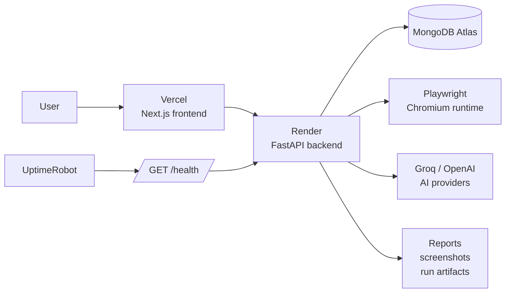

<p align="center">
  
</p>

<h1 align="center">TestPulse AI</h1>

<p align="center">
  Autonomous browser testing, AI bug analysis, evidence capture, reports, and live dashboards.
</p>

<p align="center">
  <a href="https://ai-web-testing-platform.vercel.app"></a>
  <a href="https://ai-web-testing-platform.onrender.com"></a>
  <a href="https://ai-web-testing-platform.onrender.com/health"></a>
  <a href="https://stats.uptimerobot.com/BfpfwYtaLT"></a>
  <a href="#app-architecture"></a>
</p>

```text
+----------------------------------------------------------------------------+
| TESTPULSE AI                                                                |
| Autonomous browser testing, AI bug analysis, evidence, reports, dashboards.  |
+----------------------------------------------------------------------------+
| Frontend  : https://ai-web-testing-platform.vercel.app                       |
| Backend   : https://ai-web-testing-platform.onrender.com                     |
| Health    : https://ai-web-testing-platform.onrender.com/health              |
| Status    : https://stats.uptimerobot.com/BfpfwYtaLT                        |
+----------------------------------------------------------------------------+
```

TestPulse AI is a full-stack test automation application for running
AI-assisted website checks, collecting browser evidence, tracking bugs, and
publishing reports through a production frontend and backend.

The project is prepared for a Vercel frontend, a Render backend, MongoDB storage,
and uptime monitoring for the backend health endpoint.

> [!IMPORTANT]
> In production, Vercel must point to the Render backend, and Render must allow
> the Vercel origin through `FRONTEND_ORIGINS`.

## Navigate

| Start here | Deploy | Operate |
| --- | --- | --- |
| [Local development](#local-development) | [Render backend deployment](#render-backend-deployment) | [Uptime monitoring](#uptime-monitoring) |
| [Root commands](#root-commands) | [Vercel frontend deployment](#vercel-frontend-deployment) | [Troubleshooting](#troubleshooting) |
| [App architecture](#app-architecture) | [Environment variables](#environment-variables) | [Verification checklist](#verification-checklist) |

## Live Links

| Resource | URL |
| --- | --- |
| Web app | https://ai-web-testing-platform.vercel.app |
| Signup | https://ai-web-testing-platform.vercel.app/signup |
| Backend API | https://ai-web-testing-platform.onrender.com |
| Backend health | https://ai-web-testing-platform.onrender.com/health |
| Uptime status page | https://stats.uptimerobot.com/BfpfwYtaLT |

## Product Snapshot

```text
+----------------+  +----------------+  +----------------+  +----------------+
| Plan tests     |  | Run browser AI |  | Capture bugs   |  | Publish report |
+----------------+  +----------------+  +----------------+  +----------------+
       |                  |                    |                    |
       +------------------+--------------------+--------------------+
                                  |
                                  v
                      [ test history and dashboard ]
```

- Runs AI-assisted website tests from the browser UI.
- Uses Playwright to inspect pages and collect browser evidence.
- Tracks bugs, severity, status, reproduction details, and generated fix ideas.
- Provides dashboards for test history, bugs, reports, and AI workspace activity.
- Supports authenticated users with JWT-based login and signup.
- Generates reports and stores execution history for later review.
- Exposes health endpoints for Render, Vercel, and uptime monitoring.

## App Architecture



```text
ai-web-testing-platform/
|
+-- frontend/                 Next.js App Router frontend
|   +-- src/app/              Pages and route segments
|   +-- src/components/       UI components
|   +-- src/config/api.ts     Browser-facing API URL config
|   +-- src/lib/              Client helpers and shared utilities
|
+-- backend/                  FastAPI backend
|   +-- server.py             Main FastAPI application
|   +-- routes/               API routers
|   +-- services/             Auth, AI, browser, reporting, persistence
|   +-- tests/                Backend pytest suite
|   +-- requirements.txt      Python deploy dependencies
|
+-- render.yaml               Render backend deployment blueprint
+-- package.json              Root scripts for local full-stack development
```

## Main Routes

| Area | Routes |
| --- | --- |
| Health | `/health`, `/api/health`, `/api/health/deep` |
| Auth | `/api/auth/*` |
| Test execution | `/api/tests/start`, `/api/tests`, `/api/tests/{test_id}` |
| Bugs | `/api/bugs`, `/api/bugs/{bug_id}`, bug status updates |
| Dashboard | `/api/dashboard/*` |
| Reports | `/api/reports/*` and report export endpoints |
| AI workspace | `/api/ai-workspace/*` |
| Agents/runtime | `/api/agent/*`, `/api/runtime/*`, `/api/intelligence/*` |

## Local Development

### 1. Install dependencies

```bash
npm install
npm run install:all
python -m playwright install chromium
```

`npm install` installs the root development helper dependencies.
`npm run install:all` installs the frontend packages and backend Python packages.

### 2. Configure environment files

Create the backend environment file:

```bash
backend/.env
```

Create the frontend environment file:

```bash
frontend/.env.local
```

### 3. Run the full app

```bash
npm run dev
```

Local services:

| Service | URL |
| --- | --- |
| Frontend | http://localhost:3000 |
| Backend | http://127.0.0.1:8001 |
| Backend health | http://127.0.0.1:8001/health |

## Root Commands

| Command | Purpose |
| --- | --- |
| `npm run dev` | Starts frontend and backend together |
| `npm run dev:frontend` | Starts only the Next.js frontend |
| `npm run dev:backend` | Starts only the FastAPI backend |
| `npm run install:all` | Installs frontend and backend dependencies |
| `npm run build` | Builds the frontend |
| `npm run lint` | Runs frontend linting |
| `npm run test:backend` | Runs backend tests |

## Environment Variables

### Backend

| Variable | Required | Notes |
| --- | --- | --- |
| `MONGO_URL` | Yes | MongoDB connection string. Use MongoDB Atlas for production. |
| `MONGO_DB_NAME` | Yes | Database name, for example `ai-web-testing`. |
| `JWT_SECRET_KEY` | Yes | Strong secret used to sign auth tokens. |
| `FRONTEND_ORIGINS` | Yes | Comma-separated allowed frontend origins for CORS. |
| `GROQ_API_KEY` | Optional | Enables Groq-backed AI flows. |
| `OPENAI_API_KEY` | Optional | Enables OpenAI-backed AI flows. |
| `SKIP_BROWSER_WARMUP` | Optional | Set to `1` on Render free instances if startup should stay light. |
| `STRICT_SECRETS` | Production | Set to `1` so weak production secrets are rejected. |

Production CORS value:

```bash
FRONTEND_ORIGINS=https://ai-web-testing-platform.vercel.app
```

### Frontend

| Variable | Required | Notes |
| --- | --- | --- |
| `NEXT_PUBLIC_API_URL` | Yes | Public backend URL used by the browser. |
| `NEXT_PUBLIC_API_HEALTH_PATH` | Recommended | Usually `/health`. |
| `NEXT_PUBLIC_AUTH_TIMEOUT_MS` | Recommended | Auth request timeout, for example `10000`. |

Production frontend values:

```bash
NEXT_PUBLIC_API_URL=https://ai-web-testing-platform.onrender.com
NEXT_PUBLIC_API_HEALTH_PATH=/health
NEXT_PUBLIC_AUTH_TIMEOUT_MS=10000
```

## Render Backend Deployment

The backend is configured with `render.yaml`.

```text
Build command:
pip install -r backend/requirements.txt && python -m playwright install chromium

Start command:
uvicorn backend.server:app --host 0.0.0.0 --port $PORT
```

Render setup:

1. Create a new Render web service from the GitHub repository.
2. Select the `main` branch.
3. Use the repository root as the service root.
4. Let Render detect `render.yaml`, or manually copy the build and start commands.
5. Add the required backend environment variables.
6. Deploy and confirm the health endpoint returns:

```json
{"status":"ok","service":"ai-testing-platform-backend"}
```

Important Render variables:

```bash
PYTHON_VERSION=3.13.5
STRICT_SECRETS=1
SKIP_BROWSER_WARMUP=1
FRONTEND_ORIGINS=https://ai-web-testing-platform.vercel.app
MONGO_DB_NAME=ai-web-testing
MONGO_URL=<your MongoDB connection string>
JWT_SECRET_KEY=<strong generated secret>
GROQ_API_KEY=<optional>
OPENAI_API_KEY=<optional>
```

## Vercel Frontend Deployment

Vercel setup:

1. Import the GitHub repository into Vercel.
2. Select the `main` branch.
3. Set the project root directory to `frontend`.
4. Add the production frontend environment variables.
5. Deploy.

Expected Vercel settings:

```text
Framework preset : Next.js
Root directory   : frontend
Build command    : npm run build
Output directory : .next
```

## Uptime Monitoring

Use the backend health endpoint as the monitor URL:

```text
https://ai-web-testing-platform.onrender.com/health
```

Public status page:

```text
https://stats.uptimerobot.com/BfpfwYtaLT
```

This keeps the health endpoint visible and helps detect Render cold starts,
backend crashes, CORS mistakes, missing dependencies, or database outages.

## Verification Checklist

Before pushing or deploying, run:

```bash
npm run lint
npm run build
npm run test:backend
```

Production smoke checks:

```bash
curl https://ai-web-testing-platform.onrender.com/health
curl https://ai-web-testing-platform.vercel.app
```

Then test the main browser flows:

- Signup and login.
- Start a website test.
- View test history.
- Open generated bugs.
- Open reports.
- Check dashboard data.

## Troubleshooting

### CORS blocked from Vercel

If the browser shows:

```text
No 'Access-Control-Allow-Origin' header is present
```

Set this on Render and redeploy:

```bash
FRONTEND_ORIGINS=https://ai-web-testing-platform.vercel.app
```

### Backend health works but signup fails

Check these first:

- `NEXT_PUBLIC_API_URL` on Vercel points to the Render backend.
- `FRONTEND_ORIGINS` on Render exactly matches the Vercel app origin.
- Render has been redeployed after environment variable changes.
- MongoDB allows connections from Render.

### Render says a Python module is missing

Add the missing package to:

```text
backend/requirements.txt
```

Then redeploy Render.

### MongoDB index warning on startup

A message like `Index already exists with a different name` can appear when the
database already has an equivalent index under another name. If the backend
continues to start and `/health` returns `ok`, this warning is usually not a
deployment blocker.

## Security Notes

- Do not commit `backend/.env` or `frontend/.env.local`.
- Use a strong `JWT_SECRET_KEY` in production.
- Keep `STRICT_SECRETS=1` on Render.
- Restrict `FRONTEND_ORIGINS` to trusted deployed frontend URLs.
- Rotate API keys if they were ever exposed in logs, screenshots, or commits.

## Current Production Shape

```text
+----------------------+       +----------------------+       +----------------+
| Vercel               | ----> | Render               | ----> | MongoDB Atlas  |
| Next.js frontend     |       | FastAPI backend      |       | App database   |
+----------------------+       +----------------------+       +----------------+
                                      |
                                      +--> Playwright Chromium
                                      +--> Groq / OpenAI APIs
                                      +--> Report and screenshot artifacts
```

This repository is intended to be pushed to the `main` branch and deployed from
GitHub through Vercel and Render.
